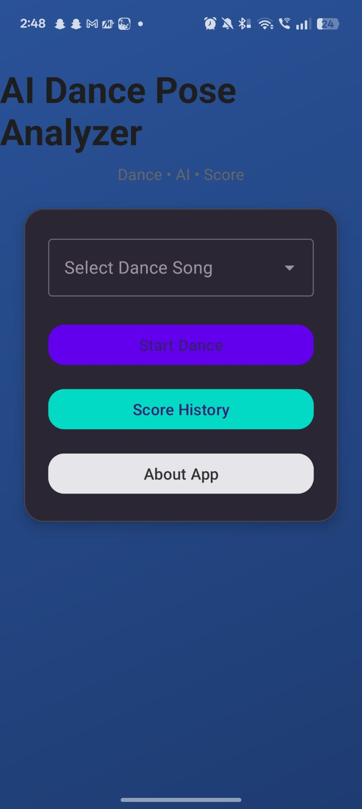
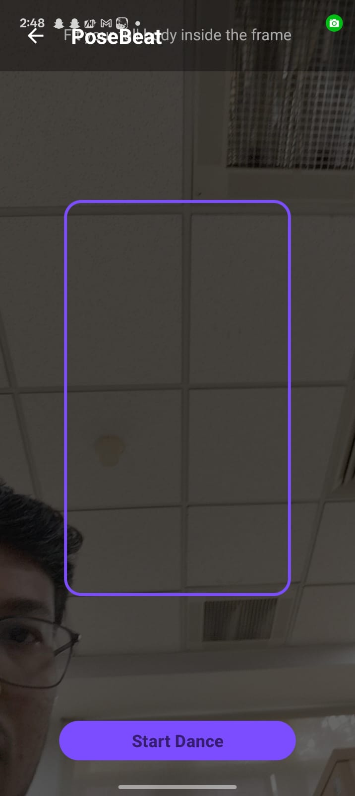
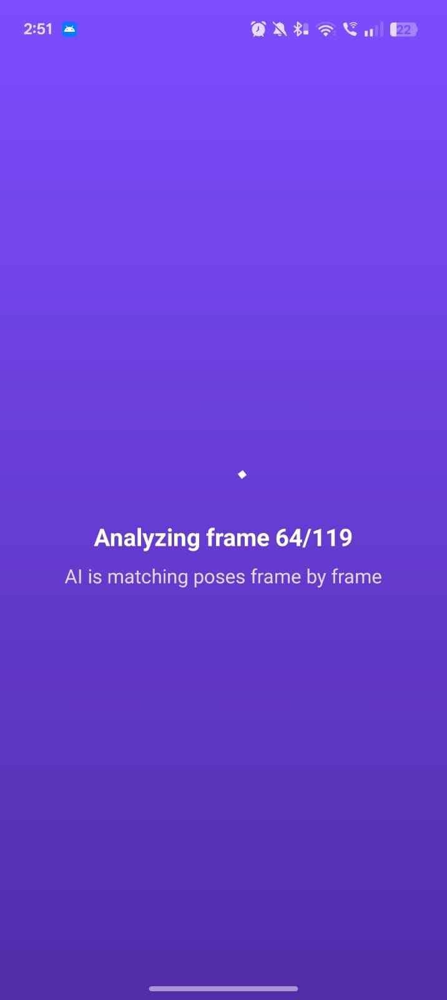
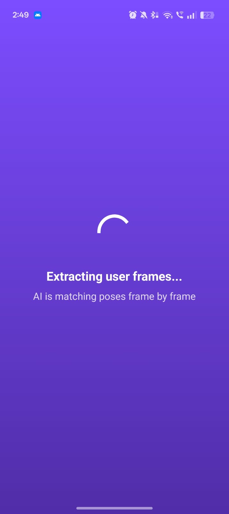
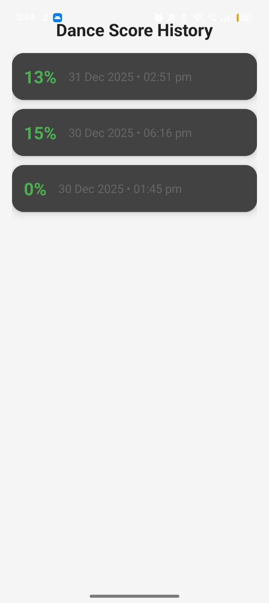

# 🎵 AIDancePoseAnalyzer – AI Dance Scoring Android App

PoseBeat is an **AI-powered Android application** that analyzes dance movements using **pose detection** and provides an accuracy score by comparing user performance with a reference dance video.

This project combines **Android development** and **AI/ML concepts**, making it a strong **learning-focused and portfolio-ready project**.

---

## 🚀 Features

- 📸 Real-time camera-based dance capture  
- 🤖 AI pose detection using **ML Kit**  
- 🎯 Dance accuracy scoring system  
- ⭐ Star rating & performance-based feedback  
- 📊 Score history tracking  
- 🎨 Modern Material UI with smooth animations  

---

## 🛠️ Tech Stack

- **Language:** Kotlin  
- **Platform:** Android  
- **Camera:** CameraX  
- **AI / ML:** ML Kit Pose Detection  
- **UI:** Material Components, ConstraintLayout  

---
 
 
## 🎬 App Flow Screens
 About.jpeg
Add files via upload
now
CameraPage.jpeg
Add files via upload
now
HomePage1.jpeg
Add files via upload
now
ProcessingPage1.jpeg
Add files via upload
now
ProcessingPage2.jpeg
Add files via upload
now
README.md
Update README.md
52 minutes ago
ResultPag
 

   

  
    
  
  
  
 
 

 
---
## 📱 App Flow

1. Select a dance song  
2. Camera opens with pose guide frame  
3. User performs dance  
4. App detects pose joints frame-by-frame  
5. User dance is compared with reference dance  
6. Final score and feedback are generated  
7. Score is saved in history  
 
 

